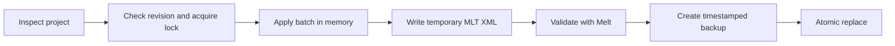

<div align="center">

# Shotcut MCP

**Create, edit, validate, preview, and render saved Shotcut projects without operating the GUI.**

[](LICENSE)
[](https://www.python.org/)
[](https://www.shotcut.org/)
[](https://modelcontextprotocol.io/)

[Quick start](#quick-start) · [Features](#features) · [Tools](#mcp-tools) · [Safety](#transactional-safety) · [Development](#development)

</div>

Shotcut MCP is a local [Model Context Protocol](https://modelcontextprotocol.io/) server for
working with [Shotcut](https://www.shotcut.org/) projects stored as MLT XML. It gives an AI client
structured tools for timeline editing while preserving Shotcut-specific project data.

It is designed for full edits of **saved project files**: build a multitrack timeline, apply effects,
generate previews, and export the result without opening Shotcut. The Shotcut installation still
provides Melt, FFmpeg, FFprobe, codecs, filters, and render services.

> [!NOTE]
> This is an independent community project. It is not affiliated with or endorsed by Shotcut or
> the MLT project.

## Why use it?

- **Faster than GUI automation:** up to 500 edits can be applied in one transaction.
- **Safer than rewriting XML blindly:** revisions, locks, validation, backups, and atomic replace
  protect the project being edited.
- **Native project output:** the result remains an editable `.mlt` project that opens in Shotcut.
- **Local by default:** the stdio server has no hosted service and uses only Python's standard
  library at runtime.
- **Discoverable effects:** filters, transitions, and consumers come from the user's installed MLT
  build instead of a fixed cloud catalog.

## Features

| Area | Capabilities |
| --- | --- |
| Tracks | Add, remove, rename, reorder, lock, hide, mute, and configure composition for video and audio tracks |
| Timeline | Add media or generators, insert gaps, overwrite, ripple-delete, trim, split, move, and remove ranges |
| Transitions | Shotcut-compatible nested crossfades with selectable MLT video services and optional audio mixing |
| Effects | Add, update, and remove MLT filters on a clip, track, or project; native keyframe property strings are supported |
| Generators | Color, dynamic text, tone, and noise |
| Project data | Profiles, notes, markers, subtitles, media relinking, and unknown XML preservation |
| Review | Project inspection, MLT validation, and frame-accurate PNG previews |
| Export | Monitored background renders for H.264, HEVC, AV1, ProRes, DNxHD, FLAC, and MP3 |
| Recovery | Timestamped backups, revision conflict detection, backup listing, and validated restore |

## Quick start

### Requirements

- Python 3.10 or newer
- Shotcut 26.2.26, or a compatible installation that provides MLT 7.37.x
- Codex CLI or another MCP client that supports local stdio servers

The current compatibility target is Shotcut **26.2.26** with MLT **7.37.0**. The integration suite
is exercised on Windows; executable discovery also supports binaries available on `PATH` and common
macOS locations.

### 1. Clone the repository

```bash
git clone https://github.com/matrodrigs/shotcut-mcp.git
cd shotcut-mcp
```

No `pip install` is required.

### 2. Register the MCP server

Use an absolute path to the server script.

**Windows PowerShell**

```powershell
codex mcp add shotcut -- python "C:\path\to\shotcut-mcp\scripts\shotcut_mcp_server.py"
```

**macOS or Linux**

```bash
codex mcp add shotcut -- python3 /absolute/path/to/shotcut-mcp/scripts/shotcut_mcp_server.py
```

Restart the MCP client or open a new task after registration.

### 3. Check the installation

Ask your MCP client:

> Check whether Shotcut MCP is ready and report the detected Shotcut, Melt, FFmpeg, and FFprobe
> versions.

The client should call `shotcut_status` and return the discovered executable paths and versions.

## Example prompts

```text
Create a 1920×1080, 30 fps Shotcut project from every video in this folder.
Put narration on A1, add 12-frame crossfades, and save it as documentary.mlt.
```

```text
Inspect documentary.mlt, remove the pauses between clips on V1, add title cards,
generate preview frames at each section boundary, and keep the project editable.
```

```text
Add these Portuguese subtitles, burn them in using a readable bottom-center style,
then render an H.264 web export. Monitor the job until it completes.
```

## Recommended workflow

1. Call `shotcut_status` to verify the local toolchain.
2. Create a project or call `inspect_project` to obtain its SHA-256 `revision`.
3. Read `shotcut_capabilities` for operation parameters.
4. Submit related changes together through `edit_project`, passing the revision as
   `expected_revision`.
5. Generate one or more previews and review the structured project snapshot.
6. Start a render and poll `render_status` until completion.

Do not save the same project from the Shotcut GUI while the MCP is editing it. For manual visual
adjustments, let the MCP finish a batch, save in Shotcut, and inspect the new revision before
continuing.

## Transactional safety



Every project edit uses the following safeguards:

- Optimistic concurrency with a SHA-256 project revision
- A per-project `.shotcut-mcp.lock` file
- MLT validation of the temporary project before replacement
- Timestamped backups in `.shotcut-mcp/backups`
- Atomic replacement only after validation succeeds
- Retention of the 20 most recent backups per project
- Preservation of unknown XML elements, attributes, and properties
- Rejection of ambiguous third-party transition layouts and ambiguous basename relinks

Existing render outputs are also protected: a new render is written to a temporary sibling file
and promoted atomically only after Melt finishes successfully.

## MCP tools

| Tool | Purpose |
| --- | --- |
| `shotcut_status` | Discover Shotcut, Melt, FFmpeg, and FFprobe and report versions |
| `shotcut_capabilities` | Return edit operations, render presets, compatibility, and workflow guidance |
| `probe_media` | Inspect streams, codecs, dimensions, frame rate, audio, and duration |
| `inspect_project` | Return revision, profile, tracks, items, filters, markers, subtitles, and resources |
| `create_project` | Create a Shotcut-compatible multitrack MLT project |
| `edit_project` | Apply up to 500 timeline operations in one validated transaction |
| `list_mlt_services` | List locally available MLT filters, transitions, producers, or consumers |
| `describe_mlt_service` | Return metadata for one installed MLT service |
| `validate_project` | Parse the project and validate it with Melt |
| `render_preview` | Render a selected frame to PNG |
| `open_in_shotcut` | Open a project or media path in the Shotcut GUI |
| `start_render` | Start a monitored background render |
| `render_status` | Return render state, progress, output information, and log tail |
| `cancel_render` | Stop a render started in the current MCP session |
| `list_project_backups` | List retained project backups and revisions |
| `restore_project_backup` | Validate and atomically restore a selected backup |

### `edit_project` operations

| Group | Operations |
| --- | --- |
| Tracks | `add_track`, `remove_track`, `update_track`, `move_track` |
| Media and generators | `add_clip`, `add_generator`, `relink_media` |
| Timeline | `remove_item`, `trim_item`, `split_item`, `move_item`, `insert_gap`, `remove_range` |
| Transitions | `add_transition`, `remove_transition` |
| Filters | `add_filter`, `update_filter`, `remove_filter` |
| Metadata | `set_notes`, `add_marker`, `remove_marker`, `set_profile` |
| Subtitles | `set_subtitle_track`, `remove_subtitle_track` |

`shotcut_capabilities` is the runtime source of truth for the accepted fields of each operation.

### Transaction example

```json
{
  "project_path": "C:/video/project.mlt",
  "expected_revision": "<revision returned by inspect_project>",
  "operations": [
    {
      "op": "add_track",
      "kind": "video",
      "name": "Titles"
    },
    {
      "op": "add_generator",
      "track": "Titles",
      "generator": "text",
      "text": "Opening title",
      "duration_frames": 90,
      "position_frame": 0,
      "mode": "overwrite"
    },
    {
      "op": "add_marker",
      "start_frame": 0,
      "text": "Intro",
      "color": "#00A0FF"
    }
  ]
}
```

## Rendering

Built-in presets are provided for common delivery and intermediate formats:

- `h264-high`
- `h264-web`
- `hevc`
- `av1`
- `prores`
- `dnxhd`
- `audio-flac`
- `audio-mp3`

Advanced callers can supply validated native `avformat` consumer properties. Codec and hardware
availability still depend on the local Shotcut/FFmpeg build.

## Configuration

Common Shotcut installations are detected automatically. Override discovery when necessary:

| Environment variable | Executable |
| --- | --- |
| `SHOTCUT_PATH` | Shotcut application |
| `SHOTCUT_MELT_PATH` | Melt executable |
| `SHOTCUT_FFMPEG_PATH` | FFmpeg executable |
| `SHOTCUT_FFPROBE_PATH` | FFprobe executable |

## Project structure

```text
shotcut-mcp/
├── .codex-plugin/plugin.json   # Codex plugin manifest
├── .mcp.json                   # Bundled MCP server configuration
├── scripts/                    # Dependency-free stdio entry point
├── shotcut_mcp/
│   ├── platform.py             # Executable discovery and MLT integration
│   ├── project.py              # Transactional MLT project model
│   ├── render.py               # Background render jobs
│   ├── server.py               # JSON-RPC/MCP stdio transport
│   └── tools.py                # Tool schemas and handlers
├── tests/                      # Unit and real Shotcut integration tests
└── docs/spec.md                # Behavioral and compatibility specification
```

## Development

Runtime code uses only the Python standard library. Development checks use Ruff and Mypy.

```bash
python -m ruff format --check shotcut_mcp scripts tests
python -m ruff check shotcut_mcp scripts tests
python -m mypy shotcut_mcp scripts tests
python -m unittest discover -s tests -v
```

Run the real Shotcut integration test explicitly:

**Windows PowerShell**

```powershell
$env:SHOTCUT_MCP_INTEGRATION = "1"
python -m unittest discover -s tests -v
```

**macOS or Linux**

```bash
SHOTCUT_MCP_INTEGRATION=1 python -m unittest discover -s tests -v
```

The integration test creates media, builds a two-clip timeline with a crossfade and title track,
validates it through Melt, renders a PNG preview, and exports H.264 video.

See [CONTRIBUTING.md](CONTRIBUTING.md) before opening a pull request. For bugs or feature requests,
use [GitHub Issues](https://github.com/matrodrigs/shotcut-mcp/issues).

## Limitations

- The MCP edits the latest project state saved to disk; it cannot see unsaved GUI changes.
- Unknown MLT XML is preserved, but edits are rejected when a target cannot be identified safely.
- Third-party filters, GPU/OpenGL services, codecs, and fonts vary by Shotcut installation.
- Changing project FPS preserves recognized timeline and marker frame numbers; it does not
  automatically retime the creative edit.
- A render detached by an MCP server restart can continue at the OS level, but it can no longer be
  cancelled safely by the restarted server.

## Resumo em português

O Shotcut MCP permite criar e editar projetos `.mlt` completos sem operar a interface do Shotcut.
Ele trabalha com faixas, clipes, transições, filtros, textos, legendas, marcadores, previews,
backups e renderização. Cada lote é validado pelo MLT antes de substituir o projeto original.

O Shotcut precisa estar instalado, mas a interface gráfica só é necessária para revisão ou ajustes
manuais. Evite salvar o mesmo projeto simultaneamente no Shotcut e no MCP.

## License

Released under the [MIT License](LICENSE).

Shotcut is a trademark of its respective owner. MLT is an independent open-source multimedia
framework. This repository contains no Shotcut or MLT source code.
