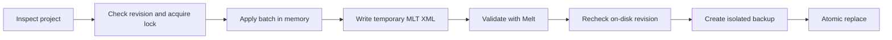

<div align="center">

# Shotcut MCP

**Create, edit, validate, preview, and render saved Shotcut projects without operating the GUI.**

[](LICENSE)
[](https://www.python.org/)
[](https://www.shotcut.org/)
[](https://modelcontextprotocol.io/)
[](https://registry.modelcontextprotocol.io/?search=io.github.matrodrigs%2Fshotcut-mcp)
[](https://matrodrigs.github.io/shotcut-mcp/)

[Demo](#demonstration) · [Quick start](#quick-start) · [Features](#features) · [Tools](#mcp-tools) · [Safety](#transactional-safety) · [Development](#development)

</div>

Shotcut MCP is a local [Model Context Protocol](https://modelcontextprotocol.io/) server for
working with [Shotcut](https://www.shotcut.org/) projects stored as MLT XML. It gives an AI client
structured tools for timeline editing while preserving Shotcut-specific project data.

It is designed for full edits of **saved project files**: build a multitrack timeline, apply effects,
generate previews, and export the result without opening Shotcut. The Shotcut installation still
provides Melt, FFmpeg, FFprobe, codecs, filters, and render services.

> [!NOTE]
> This is an independent community project. It is not affiliated with or endorsed by Shotcut or
> the MLT project.

## Demonstration

A short H.264 export created from a native Shotcut timeline edited through Shotcut MCP.

https://github.com/user-attachments/assets/c70f064f-17e7-403d-9bcf-689a9c616cdf

## Why use it?

- **Faster than GUI automation:** up to 500 edits can be applied in one transaction.
- **Safer than rewriting XML blindly:** revisions, locks, validation, backups, and atomic replace
  protect the project being edited.
- **Native project output:** the result remains an editable `.mlt` project that opens in Shotcut.
- **Local by default:** the stdio server has no hosted service and uses only Python's standard
  library at runtime.
- **Discoverable effects:** filters, transitions, consumers, and links come from the user's installed MLT
  build instead of a fixed cloud catalog.

## Features

| Area | Capabilities |
| --- | --- |
| Tracks | Add, remove, rename, reorder, lock, hide, mute, and configure composition for video and audio tracks |
| Timeline | Add, duplicate, replace, split, and move media or generators; insert gaps, overwrite, remove ranges, trim, roll, slip, slide, and apply constant or variable speed |
| Transitions | Shotcut-compatible nested crossfades with selectable MLT video services and optional audio mixing |
| Effects | Add, update, reorder, and remove MLT filters on a clip, track, or project; native keyframe property strings are supported |
| Generators | Color, dynamic text, tone, and noise |
| Project data | Profiles, semantic SDR/HLG/PQ workflows, notes, editable markers, subtitles, assisted hash-based relinking, and unknown XML preservation |
| Review | Compatibility doctor, source-quality and color analysis, inspection, read-only edit plans/diffs, MLT validation, preview batches, and atomic contact sheets |
| Export | Atomic chapter files and restart-resilient full/range/marker renders with ETA/history, safe presets, and hardware-encoder smoke detection |
| Recovery | Per-project isolated backups, revision conflict detection, backup listing, and validated restore |

## Quick start

> **MCPB package:** compatible clients can install the
> [latest packaged release](https://github.com/matrodrigs/shotcut-mcp/releases/latest).

### Requirements

- Python 3.10 or newer
- Shotcut 26.6.25, or a compatible installation that provides MLT 7.40.x
- Codex CLI or another MCP client that supports local stdio servers

The current compatibility target is Shotcut **26.6.25** with MLT **7.40.0**. The integration suite
is exercised on Windows; executable discovery also supports binaries available on `PATH` and common
macOS locations.

Additional compatibility and runtime behavior, including progress, MLT startup, and RNNoise
checks, are documented in the [behavioral specification](docs/spec.md).

### 1. Clone the repository

```bash
git clone https://github.com/matrodrigs/shotcut-mcp.git
cd shotcut-mcp
```

No `pip install` is required.

### 2. Register the MCP server

Use an absolute path to the server script.

**Windows PowerShell**

```powershell
codex mcp add shotcut -- python "C:\path\to\shotcut-mcp\scripts\shotcut_mcp_server.py"
```

**macOS or Linux**

```bash
codex mcp add shotcut -- python3 /absolute/path/to/shotcut-mcp/scripts/shotcut_mcp_server.py
```

Restart the MCP client or open a new task after registration.

### 3. Check the installation

Ask your MCP client:

> Check whether Shotcut MCP is ready and report the detected Shotcut, Melt, FFmpeg, and FFprobe
> versions.

The client should call `shotcut_status`, then `shotcut_doctor`, and return the discovered paths,
versions, repository state, RNNoise state, and active path policy.

## Example prompts

```text
Create a 1920×1080, 30 fps Shotcut project from every video in this folder.
Put narration on A1, add 12-frame crossfades, and save it as documentary.mlt.
```

```text
Inspect documentary.mlt, remove the pauses between clips on V1, add title cards,
generate preview frames at each section boundary, and keep the project editable.
```

```text
Add these Portuguese subtitles, burn them in using a readable bottom-center style,
then render an H.264 web export. Monitor the job until it completes.
```

```text
Analyze interview.mov for silence, frozen or black video, interlacing, and EBU R128 loudness.
Return the measurements before proposing any cleanup edits.
```

```text
Inspect documentary.mlt, export its point markers as chapters.txt, then render only the range
marker named "Trailer" with the H.264 web preset.
```

## Recommended workflow

1. Call `shotcut_status` and `shotcut_doctor` to verify the local toolchain and compatibility.
2. Call `probe_media` for stream facts and `analyze_media_quality` when cleanup decisions depend on
   measured silence, black frames, freezes, interlacing, or loudness.
3. Create a project or call `inspect_project` to obtain its SHA-256 `revision`.
4. Read `shotcut_capabilities` for operation parameters.
5. Optionally call `plan_project_edit` to validate the candidate and review its snapshot/XML diff
   without changing the project.
6. Submit related changes together through `edit_project`, passing the revision as
   `expected_revision`.
7. For a broad visual review, call `render_contact_sheet`; use `render_preview` for one exact
   moment or `render_preview_batch` for separate exact-frame files. Single previews and contact
   sheets can omit `output_path` to use bounded server-managed output.
8. Optionally call `export_marker_chapters` for chapter text, or start a render for the full project,
   one inclusive frame range, or one non-empty range marker. Use `render_status` for ETA/progress,
   `list_render_jobs` for history, or `cancel_render` to stop it after an MCP restart.

Do not save the same project from the Shotcut GUI while the MCP is editing it. For manual visual
adjustments, let the MCP finish a batch, save in Shotcut, and inspect the new revision before
continuing.

## Transactional safety



Every project edit uses the following safeguards:

- SHA-256 revision checks and a per-project `.shotcut-mcp.lock`
- Temporary-file MLT validation, an on-disk revision recheck, an isolated backup, and atomic replace
- Retention of the 20 most recent backups in a project-specific namespace
- Preservation of unknown XML and rejection of ambiguous transitions or basename relinks
- One canonical allowed-root/network policy for tool paths and embedded project resources
- Bounded project input, process output, render logs, history, searches, and previews

Existing preview and render outputs are also protected: output is written to a temporary sibling,
the target is checked again for concurrent changes, and promotion is atomic. A dedicated render
supervisor owns completion and cancellation independently of the MCP stdio process.

## MCP tools

| Tool | Purpose |
| --- | --- |
| `shotcut_status` | Discover Shotcut, Melt, FFmpeg, and FFprobe and report versions |
| `shotcut_doctor` | Verify Shotcut 26.6.25, MLT 7.40.x, repository startup, RNNoise, and path policy |
| `shotcut_capabilities` | Return the complete edit catalog and context, or one focused operation schema and example |
| `probe_media` | Inspect streams, codecs, dimensions, frame rate, audio, and duration |
| `analyze_media_quality` | Measure silence, black frames, freezes, interlacing, and EBU R128 loudness |
| `inspect_project` | Return revision, profile, tracks, items, filters, markers, subtitles, and resources |
| `diagnose_color_workflow` | Report normalized media color facts and Shotcut 26.6 HDR constraints |
| `diagnose_missing_media` | Search bounded roots by Shotcut hash/basename and optionally render a visual candidate sheet |
| `plan_project_edit` | Validate operations and preview their snapshot/XML diff without changing the project |
| `create_project` | Create a Shotcut-compatible multitrack MLT project |
| `edit_project` | Apply up to 500 timeline operations in one validated transaction |
| `list_mlt_services` | List locally available MLT filters, transitions, producers, consumers, or links |
| `describe_mlt_service` | Return metadata for one installed MLT service |
| `validate_project` | Parse the project and validate it with Melt |
| `render_preview` | Render a selected frame to PNG, with optional managed output |
| `render_preview_batch` | Render up to 64 exact frames with bounded per-output outcomes |
| `render_contact_sheet` | Render exact or evenly sampled frames into one atomic review image |
| `detect_hardware_encoders` | Distinguish built, advertised, and smoke-tested FFmpeg hardware encoders |
| `open_in_shotcut` | Open a project or media path in the Shotcut GUI |
| `start_render` | Start a durable full-project, inclusive-frame-range, or range-marker render |
| `export_marker_chapters` | Atomically export point markers as Shotcut chapter text |
| `render_status` | Return render state, progress, output information, and log tail |
| `list_render_jobs` | Return bounded newest-first render history with cursor pagination |
| `cancel_render` | Cancel a supervised render, including after an MCP server restart |
| `list_project_backups` | List retained project backups and revisions |
| `restore_project_backup` | Validate and atomically restore a selected backup |

### Editing contract

- Query `shotcut_capabilities` for the complete catalog or one operation's schema and example.
- `plan_project_edit` and `edit_project` enforce those same schemas before touching the project.
- Inspect first and pass the returned `revision` as `expected_revision`; never retry a conflict
  with `force` unless the user explicitly authorizes it.
- Shotcut marker `end_frame` values are exclusive; equality with `start_frame` creates a point
  marker.

### Transaction example

```json
{
  "project_path": "C:/video/project.mlt",
  "expected_revision": "<revision returned by inspect_project>",
  "operations": [
    {
      "op": "add_track",
      "kind": "video",
      "name": "Titles"
    },
    {
      "op": "add_generator",
      "track": "Titles",
      "generator": "text",
      "text": "Opening title",
      "duration_frames": 90,
      "position_frame": 0,
      "mode": "overwrite"
    },
    {
      "op": "add_marker",
      "start_frame": 0,
      "text": "Intro",
      "color": "#00A0FF"
    }
  ]
}
```

`restore_project_backup` uses the same revision guard as `edit_project`. Exact requirements for
planning, chapter export, and every operation remain discoverable through the published schemas.

## Rendering

| Use | Presets |
| --- | --- |
| Delivery | `h264-high`, `h264-web`, `hevc`, `av1` |
| HDR delivery | `hdr-hlg-hevc`, `hdr-pq-hevc` |
| Intermediate | `prores`, `dnxhd` |
| Audio | `audio-flac`, `audio-mp3` |

HDR presets use verified 10-bit software encoders; codec and hardware availability still depend on
the local build. Advanced callers may supply up to 50 scalar `avformat` properties from the safe
single-file allowlist. Arbitrary or sidecar-producing properties require administrator opt-in.

`start_render` accepts exactly one range mode: omit all range fields for the full project, supply
both `in_frame` and `out_frame` as inclusive bounds, or supply one `marker_id` returned by
`inspect_project`. Shotcut stores a range marker's end as exclusive; the MCP converts it to MLT's
inclusive `out` value and records the resolved frames in the durable job. Point markers do not
define a render range. `export_marker_chapters` follows Shotcut's `<timecode> <text>` format,
includes point markers by default, and can opt into range markers or selected colors.

## Configuration

Common Shotcut installations are detected automatically. Override discovery when necessary:

| Environment variable | Purpose |
| --- | --- |
| `SHOTCUT_PATH` | Shotcut application |
| `SHOTCUT_MELT_PATH` | Melt executable |
| `SHOTCUT_FFMPEG_PATH` | FFmpeg executable |
| `SHOTCUT_FFPROBE_PATH` | FFprobe executable |
| `SHOTCUT_MCP_ALLOWED_ROOTS` | Optional `PATH`-separator list of canonical roots available to MCP tools |
| `SHOTCUT_MCP_REQUIRE_ABSOLUTE_PATHS` | Set to `1` to reject relative tool paths |
| `SHOTCUT_MCP_ALLOW_NETWORK_RESOURCES` | Set to `1` to allow HTTP/RTSP/etc. resources embedded in projects |
| `SHOTCUT_MCP_ALLOW_UNSAFE_CONSUMER_PROPERTIES` | Set to `1` to allow arbitrary consumer properties and sidecar formats |
| `SHOTCUT_MCP_MAX_WORKERS` | Concurrent MCP tool requests, clamped to 1–8 (default 4) |
| `SHOTCUT_MCP_MAX_PENDING` | Maximum in-flight tool requests or legacy batch items, clamped to 1–256 (default 32) |
| `SHOTCUT_MCP_MAX_MESSAGE_BYTES` | Maximum newline-delimited MCP message size, clamped to 1 KiB–16 MiB (default 4 MiB) |
| `SHOTCUT_MCP_MAX_INLINE_IMAGE_BYTES` | Maximum preview image embedded in an MCP result, clamped to the message budget (default 1 MiB; `0` disables) |

Network resources and unsafe consumer properties are denied by default. These variables are
administrator policies: tools cannot override them per request. `shotcut_status` and
`shotcut_doctor` report the active policy.

## Development

Runtime code uses only the Python standard library. Run the local quality gate with:

```bash
python -m ruff format --check .
python -m ruff check .
python -m mypy
python scripts/check_release.py
python -m unittest discover -s tests -v
```

Real Shotcut integration is opt-in through `SHOTCUT_MCP_INTEGRATION=1`. See
[CONTRIBUTING.md](CONTRIBUTING.md) for development and verified release procedures, and
[CHANGELOG.md](CHANGELOG.md) for release changes. Use
[GitHub Issues](https://github.com/matrodrigs/shotcut-mcp/issues) for bugs or feature requests and
[SECURITY.md](SECURITY.md) for private vulnerability reporting.

## Limitations

- The MCP edits the latest project state saved to disk; it cannot see unsaved GUI changes.
- Unknown MLT XML is preserved, but edits are rejected when a target cannot be identified safely.
- Third-party filters, GPU/OpenGL services, codecs, and fonts vary by Shotcut installation.
- Quality analysis depends on filters present in the installed FFmpeg build. Checks run
  independently and report `unavailable` or `not_applicable` instead of failing the whole analysis.
- Speed maps currently accept positive, non-zero maps only and reject third-party/ambiguous links;
  reverse or zero-crossing ramps require additional Shotcut round-trip fixtures.
- Cross-track ripple trim remains rejected until locked-track and marker fixtures establish the
  exact Shotcut 26.6 behavior; same-track ripple/non-ripple trim is supported.
- Changing project FPS preserves recognized timeline and marker frame numbers; it does not
  automatically retime the creative edit.
- If the dedicated render supervisor itself is forcibly killed while Melt survives, the job is
  reported as `orphaned` and its temporary output is retained rather than guessed at or promoted.

## License

Released under the [MIT License](LICENSE).

Shotcut is a trademark of its respective owner. MLT is an independent open-source multimedia
framework. This repository contains no Shotcut or MLT source code.
