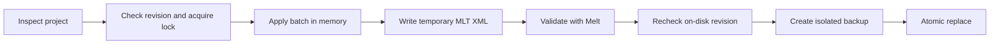

<div align="center">

# Shotcut MCP

**Create, edit, validate, preview, and render saved Shotcut projects without operating the GUI.**

[](LICENSE)
[](https://www.python.org/)
[](https://www.shotcut.org/)
[](https://modelcontextprotocol.io/)
[](https://registry.modelcontextprotocol.io/?search=io.github.matrodrigs%2Fshotcut-mcp)
[](https://matrodrigs.github.io/shotcut-mcp/)

[Demo](#demonstration) · [Quick start](#quick-start) · [Features](#features) · [Examples](#example-prompts) · [Safety](#transactional-safety) · [Reference](#mcp-tools)

</div>

Shotcut MCP is a local [Model Context Protocol](https://modelcontextprotocol.io/) server for
working with [Shotcut](https://www.shotcut.org/) projects stored as MLT XML. It gives an AI client
structured tools for timeline editing while preserving Shotcut-specific project data.

It is designed for full edits of **saved project files**: build a multitrack timeline, apply effects,
generate previews, and export the result without opening Shotcut. The Shotcut installation still
provides Melt, FFmpeg, FFprobe, codecs, filters, and render services.

> [!NOTE]
> This is an independent community project. It is not affiliated with or endorsed by Shotcut or
> the MLT project.

## Demonstration

A short H.264 export created from a native Shotcut timeline edited through Shotcut MCP.

https://github.com/user-attachments/assets/c70f064f-17e7-403d-9bcf-689a9c616cdf

## Why use it?

- **Faster than GUI automation:** up to 500 edits can be applied in one transaction.
- **Safer than rewriting XML blindly:** revisions, locks, validation, backups, and atomic replace
  protect the project being edited.
- **Native project output:** the result remains an editable `.mlt` project that opens in Shotcut.
- **Local by default:** the stdio server has no hosted service and uses only Python's standard
  library at runtime.
- **Discoverable effects:** filters, transitions, consumers, and links come from the user's installed MLT
  build instead of a fixed cloud catalog.

## Features

| Area | Capabilities |
| --- | --- |
| Tracks | Add, remove, rename, reorder, lock, hide, mute, and configure composition for video and audio tracks |
| Timeline | Add, duplicate, replace, split, and move media or generators using revision-scoped item references and transaction-local aliases; insert gaps, overwrite, remove ranges, trim, roll, slip, slide, and apply constant or variable speed |
| Transitions | Shotcut-compatible nested crossfades with selectable MLT video services and optional audio mixing |
| Effects | Animate clip pan, zoom, rotation, opacity, and volume with structured creative values; add, update, reorder, and remove native MLT filters on a clip, track, or project when lower-level control is needed |
| Generators | Color, dynamic text, tone, and noise |
| Project data | Profiles, semantic SDR/HLG/PQ workflows, notes, editable markers, subtitles, assisted hash-based relinking, and unknown XML preservation |
| Review | Compatibility doctor, source-quality and color analysis, inspection, read-only edit plans/diffs, MLT validation, preview batches, and atomic contact sheets |
| Export | Atomic chapter files and restart-resilient full/range/marker renders with ETA/history, safe presets, and hardware-encoder smoke detection |
| Recovery | Per-project isolated backups, revision conflict detection, backup listing, and validated restore |

## Quick start

> **MCPB package:** compatible clients can install the
> [latest packaged release](https://github.com/matrodrigs/shotcut-mcp/releases/latest).

### Requirements

- Python 3.10 or newer
- Shotcut 26.6.25, with MLT 7.40.0 serialization in the compatible 7.40.x family
- Codex CLI, Claude Code, or another MCP client that supports local stdio servers

Additional compatibility and runtime behavior, including progress, MLT startup, and RNNoise
checks, are documented in the [behavioral specification](docs/spec.md).

### Choose your client

| [**Codex**](#codex) | [**Claude Code**](#claude-code) | [**Other MCP clients**](#other-mcp-clients) |
| --- | --- | --- |
| Native CLI registration | Plugin marketplace | Standard MCP `stdio` |

### Codex

Clone the repository. No `pip install` is required.

```bash
git clone https://github.com/matrodrigs/shotcut-mcp.git
cd shotcut-mcp
```

Register the server using an absolute path to the checked-out script.

**Windows PowerShell**

```powershell
codex mcp add shotcut -- python "C:\path\to\shotcut-mcp\scripts\shotcut_mcp_server.py"
```

**macOS or Linux**

```bash
codex mcp add shotcut -- python3 /absolute/path/to/shotcut-mcp/scripts/shotcut_mcp_server.py
```

### Claude Code

Run these commands inside Claude Code. No repository clone is required.

```text
/plugin marketplace add matrodrigs/shotcut-mcp
/plugin install shotcut-mcp@matrodrigs
```

Run `/reload-plugins` to activate the plugin without restarting Claude Code.

<details>
<summary>Manual stdio registration</summary>

Clone the repository. No `pip install` is required.

```bash
git clone https://github.com/matrodrigs/shotcut-mcp.git
cd shotcut-mcp
```

Then register the server directly using an absolute path to the checked-out script.

**Windows PowerShell**

```powershell
claude mcp add --transport stdio --scope user shotcut -- python "C:\path\to\shotcut-mcp\scripts\shotcut_mcp_server.py"
```

**macOS or Linux**

```bash
claude mcp add --transport stdio --scope user shotcut -- python3 /absolute/path/to/shotcut-mcp/scripts/shotcut_mcp_server.py
```

From a source checkout, Claude Code can also use the checked-in `.mcp.json` as project-scoped
configuration when it is started from the repository root. Review and approve the server when
prompted.

</details>

### Other MCP clients

Clone the repository. No `pip install` is required.

```bash
git clone https://github.com/matrodrigs/shotcut-mcp.git
cd shotcut-mcp
```

Configure a local `stdio` server with these values:

| Setting | Value |
| --- | --- |
| Name | `shotcut` |
| Command | `python` on Windows; `python3` on macOS or Linux |
| Argument | Absolute path to `scripts/shotcut_mcp_server.py` |

The `.codex-plugin` and `.claude-plugin` manifests are thin client adapters. The Claude marketplace
entry only adds discovery and installation. Every route starts the same dependency-free Python
server; the tools, schemas, and project-safety behavior do not fork by client.

Restart the MCP client or open a new task after registration.

### Verify the installation

Ask your MCP client:

> Check whether Shotcut MCP is ready and report the detected Shotcut, Melt, FFmpeg, and FFprobe
> versions.

A healthy setup reports the discovered paths, versions, repository state, RNNoise availability,
and active path policy. If anything is missing, the response should explain what needs attention.

## Example prompts

```text
Create a 1920×1080, 30 fps Shotcut project from every video in this folder.
Put narration on A1, add 12-frame crossfades, and save it as documentary.mlt.
```

```text
Inspect documentary.mlt, remove the pauses between clips on V1, add title cards,
add a slow push-in with smooth audio and video fades, generate preview frames at each
section boundary, and keep the project editable.
```

```text
Add these Portuguese subtitles, burn them in using a readable bottom-center style,
then render an H.264 web export. Monitor the job until it completes.
```

```text
Analyze interview.mov for silence, frozen or black video, interlacing, and EBU R128 loudness.
Return the measurements before proposing any cleanup edits.
```

```text
Inspect documentary.mlt, export its point markers as chapters.txt, then render only the range
marker named "Trailer" with the H.264 web preset.
```

## Recommended workflow

Describe the result you want in ordinary language. The MCP client receives tool-specific guidance
at runtime, so you do not need to know individual tool names or request schemas.

1. Begin with a readiness check for Shotcut MCP and the local media tools.
2. Provide the saved `.mlt` project and source media, then describe the result you want.
3. For cleanup work, review measurements such as silence, black frames, freezes, interlacing, or
   loudness before choosing which changes to apply.
4. For a large or sensitive edit, review the proposed changes before applying them.
5. After each visual edit batch, you receive a concise change summary and representative frames or
   a contact sheet, making it easy to request another adjustment.
6. When the edit is ready, request an export. If export was not already explicit, confirm the
   project, output, preset, range or duration, and overwrite behavior first. During rendering, you
   receive meaningful progress updates; on completion, you receive both the video and its exact
   editable project.

Let an MCP edit finish before saving the same project from the Shotcut GUI. After manual adjustments,
save in Shotcut and ask the client to inspect the project again before continuing.

## Transactional safety


```mermaid
flowchart LR
    A["Inspect project"] --> B["Check revision and acquire lock"]
    B --> C["Apply batch in memory"]
    C --> D["Write temporary MLT XML"]
    D --> E["Validate with Melt"]
    E --> F["Recheck on-disk revision"]
    F --> G["Create isolated backup"]
    G --> H["Atomic replace"]
```

Every project edit uses the following safeguards:

- SHA-256 revision checks and a per-project `.shotcut-mcp.lock`
- Temporary-file MLT validation, an on-disk revision recheck, an isolated backup, and atomic replace
- Retention of the 20 most recent backups in a project-specific namespace
- Preservation of unknown XML and rejection of ambiguous transitions or basename relinks
- One canonical allowed-root/network policy for tool paths and embedded project resources
- Bounded MCP input/output, project candidates (128 MiB by default), process output, render logs,
  history, searches, and previews

Existing preview and render outputs are also protected: output is written to a temporary sibling,
the target is checked again for concurrent changes, and promotion is atomic. A dedicated render
supervisor owns completion and cancellation independently of the MCP stdio process. Every render
uses an immutable byte-for-byte sibling project snapshot, so later edits to the live project cannot
change the running job; the successful snapshot is retained as the exact editable delivery artifact.

## MCP tools

Most users can work entirely through natural-language prompts. This reference is for client authors,
integrators, and anyone who wants to understand the available tool surface.

| Tool | Purpose |
| --- | --- |
| `shotcut_status` | Discover Shotcut, Melt, FFmpeg, and FFprobe and report versions |
| `shotcut_doctor` | Verify the Shotcut/MLT stack, RNNoise, FFmpeg analyzer availability, and path policy |
| `shotcut_capabilities` | Return the complete edit catalog and context, or one focused operation schema and example |
| `probe_media` | Inspect streams, codecs, dimensions, frame rate, audio, and duration |
| `analyze_media_quality` | Measure silence, black frames, freezes, interlacing, and EBU R128 loudness |
| `inspect_project` | Return revision, profile, tracks, revision-scoped item references, filters, markers, subtitles, and resources |
| `diagnose_color_workflow` | Report normalized media color facts and Shotcut 26.6 HDR constraints |
| `diagnose_missing_media` | Search bounded roots by Shotcut hash/basename and optionally render a visual candidate sheet |
| `plan_project_edit` | Validate stable-reference operations and preview their snapshot/XML diff without changing the project |
| `create_project` | Create a Shotcut-compatible multitrack MLT project |
| `edit_project` | Apply up to 500 timeline operations using stable item references and aliases in one validated transaction, then summarize and visually review relevant changes |
| `list_mlt_services` | List locally available MLT filters, transitions, producers, consumers, or links |
| `describe_mlt_service` | Return metadata for one installed MLT service |
| `validate_project` | Report first-frame Melt `valid` status and dependency-complete `ready` status |
| `render_preview` | Render a selected frame to PNG, with optional managed output |
| `render_preview_batch` | Render up to 64 exact frames with bounded per-output outcomes |
| `render_contact_sheet` | Render exact or evenly sampled frames into one atomic review image |
| `detect_hardware_encoders` | Distinguish built, advertised, and smoke-tested FFmpeg hardware encoders |
| `open_in_shotcut` | Open a project or media path in the Shotcut GUI |
| `start_render` | After explicit export intent or approval, snapshot one revision and start a durable full-project, range, or marker render |
| `export_marker_chapters` | Atomically export point markers as Shotcut chapter text |
| `render_status` | Monitor meaningful progress to a terminal state and return media plus exact editable-project artifacts on completion |
| `list_render_jobs` | Return bounded newest-first render history with cursor pagination |
| `cancel_render` | Cancel a supervised render, including after an MCP server restart |
| `list_project_backups` | List retained project backups and revisions |
| `restore_project_backup` | Validate and atomically restore a selected backup |

Clients receive full JSON schemas, operation examples, revision requirements, stable item-reference
guidance, and animation contracts at runtime. Integrators can consult the
[behavioral specification](docs/spec.md); the published tool schemas remain the source of truth
for request parameters.

## Rendering

| Use | Presets |
| --- | --- |
| Delivery | `h264-high`, `h264-web`, `hevc`, `av1` |
| HDR delivery | `hdr-hlg-hevc`, `hdr-pq-hevc` |
| Intermediate | `prores`, `dnxhd` |
| Audio | `audio-flac`, `audio-mp3` |

Ask the client to render the complete project, a precise frame range, or a named range marker. If
export was not already explicit, the client should first show the project, output, preset,
range/duration, and overwrite behavior and wait for approval; it should not ask twice after an
explicit export request. Renders run under a durable supervisor, so progress can still be checked
or cancellation requested after the MCP client restarts. Clients should report material status,
progress, or ETA changes rather than unchanged polls or raw logs.

`start_render` accepts the inspected `expected_revision` and captures the saved project once into a
sibling `<project>.render-<job_id>.mlt` file before the worker starts. Melt reads only this immutable
snapshot. When `render_status` reaches `completed`, modern MCP clients receive resource links for
both the rendered media and that exact editable project; older clients receive both canonical paths
and artifact metadata in text.

HDR presets use verified 10-bit software encoders; codec and hardware availability still depend on
the local build. Preview and final outputs are written transactionally and replace their destination
only after the new file completes successfully.

## Configuration

Common Shotcut installations are detected automatically, so most users can skip this section.
Administrators and client integrators can override discovery or tighten runtime policy when needed:

| Environment variable | Purpose |
| --- | --- |
| `SHOTCUT_PATH` | Shotcut application |
| `SHOTCUT_MELT_PATH` | Melt executable |
| `SHOTCUT_FFMPEG_PATH` | FFmpeg executable |
| `SHOTCUT_FFPROBE_PATH` | FFprobe executable |
| `SHOTCUT_MCP_ALLOWED_ROOTS` | Optional `PATH`-separator list of canonical roots available to MCP tools |
| `SHOTCUT_MCP_REQUIRE_ABSOLUTE_PATHS` | Set to `1` to reject relative tool paths |
| `SHOTCUT_MCP_ALLOW_NETWORK_RESOURCES` | Set to `1` to allow HTTP/RTSP/etc. resources embedded in projects |
| `SHOTCUT_MCP_ALLOW_UNSAFE_CONSUMER_PROPERTIES` | Set to `1` to allow arbitrary consumer properties and sidecar formats |
| `SHOTCUT_MCP_MAX_WORKERS` | Concurrent MCP tool requests, clamped to 1–8 (default 4) |
| `SHOTCUT_MCP_MAX_PENDING` | Maximum in-flight tool requests or legacy batch items, clamped to 1–256 (default 32) |
| `SHOTCUT_MCP_MAX_PROJECT_BYTES` | Maximum saved MLT project size, clamped to 1–512 MiB (default 128 MiB) |
| `SHOTCUT_MCP_MAX_MESSAGE_BYTES` | Maximum inbound or outbound newline-delimited MCP message size, clamped to 1 KiB–16 MiB (default 4 MiB) |
| `SHOTCUT_MCP_MAX_INLINE_IMAGE_BYTES` | Maximum preview image embedded in an MCP result, clamped to the message budget (default 1 MiB; `0` disables) |

Network resources and unsafe consumer properties are denied by default. These variables are
administrator policies: tools cannot override them per request. `shotcut_status` and
`shotcut_doctor` report the active policy.

## Development

Runtime code uses only the Python standard library. Run the local quality gate with:

```bash
python -m pip install -r requirements-dev.txt
python -B scripts/check_ci.py all
```

Enable the versioned pre-push gate once per clone so the same command runs before changes
reach GitHub:

```bash
git config core.hooksPath .githooks
```

Real Shotcut integration is opt-in through `SHOTCUT_MCP_INTEGRATION=1`. See
[CONTRIBUTING.md](CONTRIBUTING.md) for development and verified release procedures, and
[CHANGELOG.md](CHANGELOG.md) for release changes. Use
[GitHub Issues](https://github.com/matrodrigs/shotcut-mcp/issues) for bugs or feature requests and
[SECURITY.md](SECURITY.md) for private vulnerability reporting.

## Limitations

- The MCP edits the latest project state saved to disk; it cannot see unsaved GUI changes.
- Unknown MLT XML is preserved, but edits are rejected when a target cannot be identified safely.
- Third-party filters, GPU/OpenGL services, codecs, and fonts vary by Shotcut installation.
- Quality analysis depends on filters present in the installed FFmpeg build. Checks run
  independently and report `unavailable` or `not_applicable` instead of failing the whole analysis.
- Speed maps accept wholly forward or wholly reverse non-zero ramps. Zero-crossing ramps and
  third-party/ambiguous chain links remain rejected.
- Ripple trim can affect only the target track or every unlocked track. Locked tracks are left
  unchanged, and a cross-track removal that intersects a transition is rejected rather than
  rewired speculatively.
- Changing project FPS preserves recognized timeline and marker frame numbers; it does not
  automatically retime the creative edit.
- If the dedicated render supervisor itself is forcibly killed while Melt survives, the job is
  reported as `orphaned` and its temporary output is retained rather than guessed at or promoted.

## License

Released under the [MIT License](LICENSE).

Shotcut is a trademark of its respective owner. MLT is an independent open-source multimedia
framework. This repository contains no Shotcut or MLT source code.
