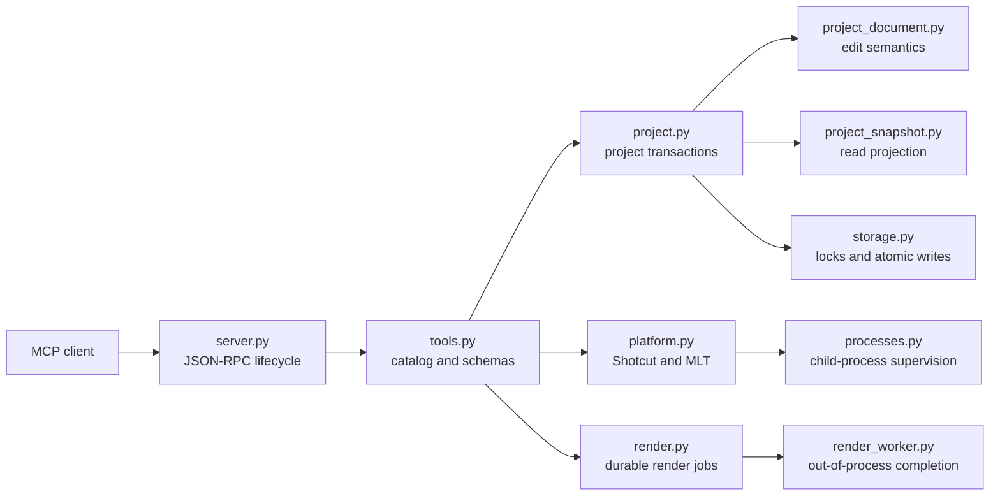

# Shotcut MCP architecture

Shotcut MCP is a dependency-free Python MCP server organized around a small protocol layer,
transactional project editing, and isolated adapters for Shotcut, MLT, FFmpeg, FFprobe, and the
filesystem.

## Runtime flow



`server.py` owns MCP transport and lifecycle behavior. `tools.py` publishes the public tool
interface and routes validated calls. Timeline rules remain in the project model, while operating
system, process, path, and storage concerns stay behind their respective modules.

## Repository layout

```text
shotcut-mcp/
├── .codex-plugin/plugin.json   # Codex plugin manifest
├── .github/workflows/          # Cross-platform CI and verified registry publishing
├── scripts/                    # Stdio entry point and release metadata checks
├── shotcut_mcp/
│   ├── media.py                # Cached FFprobe inspection and quality analysis
│   ├── missing_media.py        # Bounded missing-resource search and scoring
│   ├── mlt_xml.py              # Shared MLT XML primitive decoding
│   ├── path_policy.py          # Canonical path and network-resource policy
│   ├── platform.py             # Public Shotcut/MLT orchestration interface
│   ├── processes.py            # Executable discovery and process supervision
│   ├── project.py              # Transactional project workflow
│   ├── project_document.py     # Structure-preserving MLT document model
│   ├── project_snapshot.py     # Read-only MCP project projection
│   ├── protocol.py             # Schema validation, cancellation, and progress context
│   ├── render.py               # Public render-job interface
│   ├── render_jobs.py          # Durable private job store
│   ├── render_worker.py        # Restart-resilient render supervisor
│   ├── server.py               # Concurrent JSON-RPC/MCP stdio transport
│   ├── storage.py              # Locks, backups, revisions, and atomic output transactions
│   └── tools.py                # MCP tool catalog, schemas, and handlers
├── tests/                      # Unit and opt-in real Shotcut integration tests
└── docs/
    ├── architecture.md         # Module layout and dependency flow
    └── spec.md                 # Behavioral and compatibility specification
```

## Design constraints

- Project files and rendered outputs are user data and are never replaced before validation.
- Public MCP handlers remain thin; edit semantics belong to `project_document.py`.
- Read projections belong to `project_snapshot.py`; filesystem transactions do not.
- Executable discovery and cancellable child-process supervision belong to `processes.py`.
- User-controlled paths pass through `path_policy.py`.
- Render completion is owned by a durable worker outside the MCP stdio process.
- Runtime code supports Python 3.10+ and uses only the standard library.

See the [behavioral specification](spec.md) for compatibility boundaries and verified behavior.
