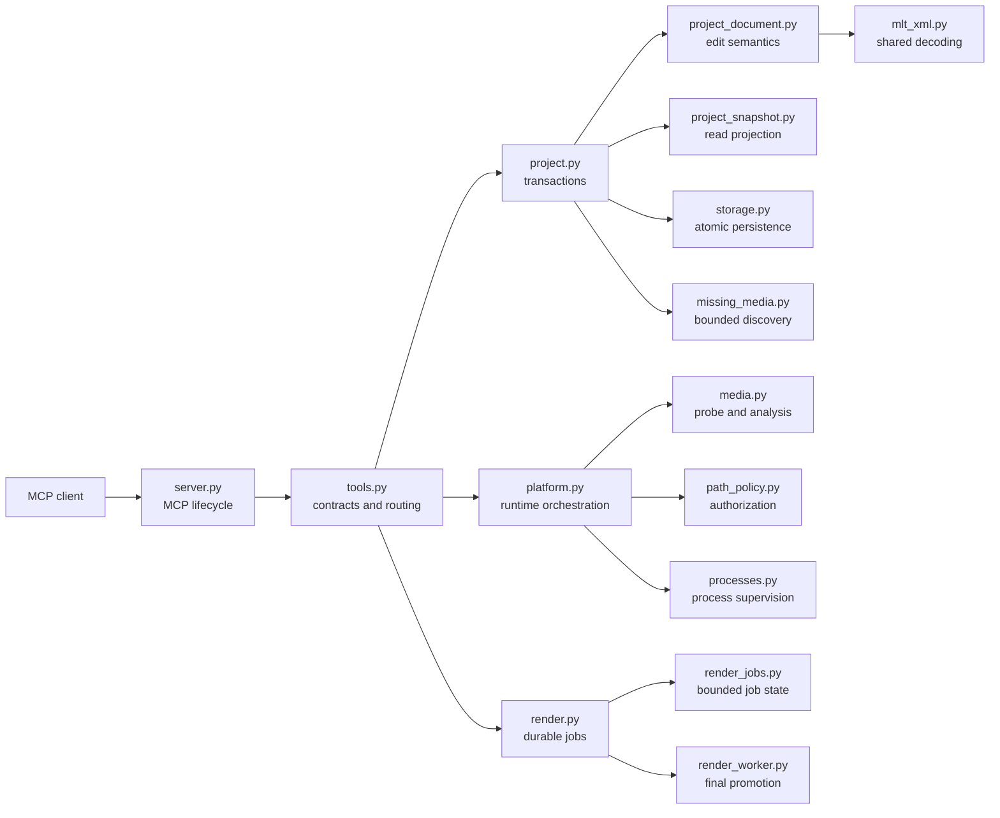

# Shotcut MCP architecture

Shotcut MCP is a dependency-free Python MCP server organized around deep public seams: MCP
transport, tool contracts, project transactions, runtime orchestration, and durable rendering.
The lower-level modules own XML, path, process, media, and storage mechanics so callers do not
need to coordinate those details themselves.

## Runtime flow


```mermaid
flowchart LR
    Client["MCP client"] --> Server["server.py<br>MCP lifecycle"]
    Server --> Tools["tools.py<br>contracts and routing"]
    Tools --> Project["project.py<br>transactions"]
    Tools --> Platform["platform.py<br>runtime orchestration"]
    Tools --> Render["render.py<br>durable jobs"]
    Project --> Document["project_document.py<br>edit semantics"]
    Project --> Snapshot["project_snapshot.py<br>read projection"]
    Project --> Storage["storage.py<br>atomic persistence"]
    Project --> Missing["missing_media.py<br>bounded discovery"]
    Platform --> Media["media.py<br>probe and analysis"]
    Platform --> Paths["path_policy.py<br>authorization"]
    Platform --> Processes["processes.py<br>process supervision"]
    Render --> Jobs["render_jobs.py<br>bounded job state"]
    Render --> Worker["render_worker.py<br>final promotion"]
    Document --> XML["mlt_xml.py<br>shared decoding"]
```

The diagram follows runtime calls and worker launches. The import rules are:

```text
server -> protocol, tools
tools -> platform, project, protocol, render
project -> missing_media, platform, project_document, project_snapshot, protocol, storage
missing_media -> platform, protocol
project_document -> media, mlt_xml, protocol
project_snapshot -> project_document, mlt_xml, path_policy
render -> platform, project_snapshot, protocol, render_jobs, storage
render_worker -> platform, render_jobs, storage
render_jobs -> protocol, storage
platform -> media, path_policy, processes, protocol, storage
media -> processes, protocol
path_policy -> mlt_xml
processes -> path_policy, protocol
storage -> processes
```

Runtime modules may also import the shared `errors` module. Standard-library imports and
imports guarded by `TYPE_CHECKING` are omitted. Tests verify this graph and reject runtime cycles.

Imports should continue downward through this graph. `project.py` and `platform.py` are stable
public seams; internal modules may be reorganized without making MCP handlers depend on private
mechanics.

## Ownership and sources of truth

| Concern | Owner | Public projection |
| --- | --- | --- |
| JSON-RPC lifecycle, concurrency, cancellation, progress | `server.py` | MCP transport |
| Tool names, schemas, annotations, examples | `tools.py` | `tools/list`, `shotcut_capabilities` |
| Transaction ordering, locks, revision checks | `project.py` | Project workflow functions |
| Timeline invariants and edit semantics | `project_document.py` | `ProjectDocument` through `project.py` |
| Item selectors and transaction-local alias semantics | `project_document.py` | Derived operation schemas in `tools.py` |
| Read-only project shape and timing | `project_snapshot.py` | `inspect_project`, render timing |
| Missing-resource search, scoring, and visualization | `missing_media.py` | `diagnose_missing_media` through `project.py` |
| Executable and MLT orchestration | `platform.py` | Stable platform functions |
| Executable discovery and child-process lifetime | `processes.py` | Re-exported through `platform.py` |
| FFprobe caching, media summaries, FFmpeg analyzer commands and parsers | `media.py` | Media tools through `platform.py` |
| Canonical path and network-resource policy | `path_policy.py` | All user-controlled data paths |
| Shared MLT properties and clock decoding | `mlt_xml.py` | Document and path-policy internals |
| Durable render-job lifecycle | `render.py` | Render tools |
| Out-of-process render ownership and final promotion | `render_worker.py` | Launched by the render workflow |
| Persistent job metadata and bounded logs | `render_jobs.py` | Render and worker internals |
| Locks, backups, revisions, atomic output | `storage.py` | Transaction owners only |
| Schema validation and request-scoped cancellation/progress | `protocol.py` | Server and domain request context |
| Project baseline and tested runtime pairs | `shotcut_mcp/__init__.py` | Projects, doctor, capabilities, CI |

The operation selector/alias declaration is immutable and shared by edit execution and capability
generation. Compatibility values are likewise declared once in the package and checked against
the maintained public documentation during release validation.

## Repository layout

```text
shotcut-mcp/
|-- .claude-plugin/           # Claude Code adapter and marketplace metadata
|-- .codex-plugin/            # Codex adapter
|-- .github/workflows/        # Cross-platform CI and verified publishing
|-- docs/                     # Architecture, behavior, and project website
|-- scripts/                  # Server entry point and release/check tooling
|-- shotcut_mcp/              # Dependency-free runtime package
`-- tests/                    # Tests grouped by project, protocol, platform, media, and render seams
```

Codex and Claude Code packaging remain adapters over the same MCP entry point. See
[Contributing](../CONTRIBUTING.md) for tests and releases and the
[behavioral specification](spec.md) for compatibility and preservation contracts.
