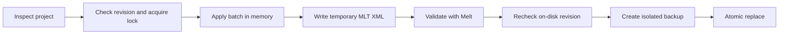

# Technical reference

[Shotcut MCP](../README.md) · [Installation](installation.md) · [Workflow and examples](workflows.md)

Detailed capabilities, MCP tools, export presets, and runtime policy for client authors,
integrators, and users who need more control.

[Features](#features) · [Tools](#mcp-tools) · [Rendering](#rendering) · [Configuration](#configuration) · [Safety](#transactional-safety) · [Limitations](#limitations)

## Features

| Area | Capabilities |
| --- | --- |
| Tracks | Add, remove, rename, reorder, lock, hide, mute, and configure composition for video and audio tracks |
| Timeline | Add, duplicate, replace, split, and move media or generators using revision-scoped item references and transaction-local aliases; insert gaps, overwrite, remove ranges, trim, roll, slip, slide, and apply constant or variable speed |
| Transitions | Shotcut-compatible nested crossfades with selectable MLT video services and optional audio mixing |
| Effects | Animate clip pan, zoom, rotation, opacity, and volume with structured creative values; add, update, reorder, and remove native MLT filters on a clip, track, or project when lower-level control is needed |
| Generators | Color, dynamic text, tone, and noise |
| Project data | Profiles, semantic SDR/HLG/PQ workflows, notes, editable markers, subtitles, assisted hash-based relinking, and unknown XML preservation |
| Review | Compatibility doctor, source-quality and color analysis, inspection, read-only edit plans/diffs, MLT validation, preview batches, and atomic contact sheets |
| Export | Atomic chapter files and restart-resilient full/range/marker renders with ETA/history, safe presets, and hardware-encoder smoke detection |
| Recovery | Per-project isolated backups, revision conflict detection, backup listing, and validated restore |

## MCP tools

Most users can work entirely through natural-language prompts. This reference is for client authors,
integrators, and anyone who wants to understand the available tool surface.

| Tool | Purpose |
| --- | --- |
| `shotcut_status` | Discover Shotcut, Melt, FFmpeg, and FFprobe and report versions |
| `shotcut_doctor` | Verify the Shotcut/MLT stack, RNNoise, FFmpeg analyzer availability, and path policy |
| `shotcut_capabilities` | Return the complete edit catalog and context, or one focused operation schema and example |
| `probe_media` | Inspect streams, codecs, dimensions, frame rate, audio, and duration |
| `analyze_media_quality` | Measure silence, black frames, freezes, interlacing, and EBU R128 loudness |
| `inspect_project` | Return revision, profile, tracks, revision-scoped item references, filters, markers, subtitles, and resources |
| `diagnose_color_workflow` | Report normalized media color facts and Shotcut 26.6 HDR constraints |
| `diagnose_missing_media` | Search bounded roots by Shotcut hash/basename and optionally render a visual candidate sheet |
| `plan_project_edit` | Validate stable-reference operations and preview their snapshot/XML diff without changing the project |
| `create_project` | Create a Shotcut-compatible multitrack MLT project |
| `edit_project` | Apply up to 500 timeline operations using stable item references and aliases in one validated transaction, then summarize and visually review relevant changes |
| `list_mlt_services` | List locally available MLT filters, transitions, producers, consumers, or links |
| `describe_mlt_service` | Return metadata for one installed MLT service |
| `validate_project` | Report first-frame Melt `valid` status and dependency-complete `ready` status |
| `render_preview` | Render a selected frame to PNG, with optional managed output |
| `render_preview_batch` | Render up to 64 exact frames with bounded per-output outcomes |
| `render_contact_sheet` | Render exact or evenly sampled frames into one atomic review image |
| `detect_hardware_encoders` | Distinguish built, advertised, and smoke-tested FFmpeg hardware encoders |
| `open_in_shotcut` | Open a project or media path in the Shotcut GUI |
| `start_render` | After explicit export intent or approval, snapshot one revision and start a durable full-project, range, or marker render |
| `export_marker_chapters` | Atomically export point markers as Shotcut chapter text |
| `render_status` | Monitor meaningful progress to a terminal state and return media plus exact editable-project artifacts on completion |
| `list_render_jobs` | Return bounded newest-first render history with cursor pagination |
| `cancel_render` | Cancel a supervised render, including after an MCP server restart |
| `list_project_backups` | List retained project backups and revisions |
| `restore_project_backup` | Validate and atomically restore a selected backup |

Clients receive full JSON schemas, operation examples, revision requirements, stable item-reference
guidance, and animation contracts at runtime. Integrators can consult the
[behavioral specification](spec.md); the published tool schemas remain the source of truth
for request parameters.

## Rendering

| Use | Presets |
| --- | --- |
| Delivery | `h264-high`, `h264-web`, `hevc`, `av1` |
| HDR delivery | `hdr-hlg-hevc`, `hdr-pq-hevc` |
| Intermediate | `prores`, `dnxhd` |
| Audio | `audio-flac`, `audio-mp3` |

Ask the client to render the complete project, a precise frame range, or a named range marker. If
export was not already explicit, the client should first show the project, output, preset,
range/duration, and overwrite behavior and wait for approval; it should not ask twice after an
explicit export request. Renders run under a durable supervisor, so progress can still be checked
or cancellation requested after the MCP client restarts. Clients should report material status,
progress, or ETA changes rather than unchanged polls or raw logs.

`start_render` accepts the inspected `expected_revision` and captures the saved project once into a
sibling `<project>.render-<job_id>.mlt` file before the worker starts. Melt reads only this immutable
snapshot. When `render_status` reaches `completed`, modern MCP clients receive resource links for
both the rendered media and that exact editable project; older clients receive both canonical paths
and artifact metadata in text.

HDR presets use verified 10-bit software encoders; codec and hardware availability still depend on
the local build. Preview and final outputs are written transactionally and replace their destination
only after the new file completes successfully.

## Configuration

Common Shotcut installations are detected automatically, so most users can skip this section.
Administrators and client integrators can override discovery or tighten runtime policy when needed:

| Environment variable | Purpose |
| --- | --- |
| `SHOTCUT_PATH` | Shotcut application |
| `SHOTCUT_MELT_PATH` | Melt executable |
| `SHOTCUT_FFMPEG_PATH` | FFmpeg executable |
| `SHOTCUT_FFPROBE_PATH` | FFprobe executable |
| `SHOTCUT_MCP_ALLOWED_ROOTS` | Optional `PATH`-separator list of canonical roots available to MCP tools |
| `SHOTCUT_MCP_REQUIRE_ABSOLUTE_PATHS` | Set to `1` to reject relative tool paths |
| `SHOTCUT_MCP_ALLOW_NETWORK_RESOURCES` | Set to `1` to allow HTTP/RTSP/etc. resources embedded in projects |
| `SHOTCUT_MCP_ALLOW_UNSAFE_CONSUMER_PROPERTIES` | Set to `1` to allow arbitrary consumer properties and sidecar formats |
| `SHOTCUT_MCP_MAX_WORKERS` | Concurrent MCP tool requests, clamped to 1–8 (default 4) |
| `SHOTCUT_MCP_MAX_PENDING` | Maximum in-flight tool requests or legacy batch items, clamped to 1–256 (default 32) |
| `SHOTCUT_MCP_MAX_PROJECT_BYTES` | Maximum saved MLT project size, clamped to 1–512 MiB (default 128 MiB) |
| `SHOTCUT_MCP_MAX_MESSAGE_BYTES` | Maximum inbound or outbound newline-delimited MCP message size, clamped to 1 KiB–16 MiB (default 4 MiB) |
| `SHOTCUT_MCP_MAX_INLINE_IMAGE_BYTES` | Maximum preview image embedded in an MCP result, clamped to the message budget (default 1 MiB; `0` disables) |

Network resources and unsafe consumer properties are denied by default. These variables are
administrator policies: tools cannot override them per request. `shotcut_status` and
`shotcut_doctor` report the active policy.

## Transactional safety

Every project edit uses the following safeguards:

- SHA-256 revision checks and a per-project `.shotcut-mcp.lock`
- Temporary-file MLT validation, an on-disk revision recheck, an isolated backup, and atomic replace
- Retention of the 20 most recent backups in a project-specific namespace
- Preservation of unknown XML and rejection of ambiguous transitions or basename relinks
- One canonical allowed-root/network policy for tool paths and embedded project resources
- Bounded MCP input/output, project candidates (128 MiB by default), process output, render logs,
  history, searches, and previews

Existing preview and render outputs are also protected: output is written to a temporary sibling,
the target is checked again for concurrent changes, and promotion is atomic. A dedicated render
supervisor owns completion and cancellation independently of the MCP stdio process. Every render
uses an immutable byte-for-byte sibling project snapshot, so later edits to the live project cannot
change the running job; the successful snapshot is retained as the exact editable delivery artifact.
The supervisor loads the bundled package independently of the client's working directory and
preserves that directory for relative paths. If worker initialization fails before rendering,
`render_status.log_tail` includes the bounded startup diagnostic when available.

## Limitations

- The MCP edits the latest project state saved to disk; it cannot see unsaved GUI changes.
- Unknown MLT XML is preserved, but edits are rejected when a target cannot be identified safely.
- Third-party filters, GPU/OpenGL services, codecs, and fonts vary by Shotcut installation.
- Quality analysis depends on filters present in the installed FFmpeg build. Checks run
  independently and report `unavailable` or `not_applicable` instead of failing the whole analysis.
- Speed maps accept wholly forward or wholly reverse non-zero ramps. Zero-crossing ramps and
  third-party/ambiguous chain links remain rejected.
- Replacing a speed map retains its selected source interval, including after trims or splits.
  Maps created by older versions without original source bounds, or changed outside the owned
  mapping, must be rebuilt from the original clip before replacement. Use a backup when needed;
  the server leaves the project unchanged when it cannot establish the source range safely.
- The tested MLT timeremap can return an invalid image when negative-speed integration lands
  on source frame zero. Such maps are rejected with `speed_map_reverse_boundary_unsupported`;
  no source frames are silently removed and no speed values are perturbed. For constant reversal,
  use `set_clip_speed`; otherwise choose a source range that stays above zero. This boundary needs
  an upstream MLT fix before it can be included in the verified interface.
- Ripple trim can affect only the target track or every unlocked track. Locked tracks are left
  unchanged, and a cross-track removal that intersects a transition is rejected rather than
  rewired speculatively.
- Changing project FPS preserves recognized timeline and marker frame numbers; it does not
  automatically retime the creative edit.
- If the dedicated render supervisor itself is forcibly killed while Melt survives, the job is
  reported as `orphaned` and its temporary output is retained rather than guessed at or promoted.
